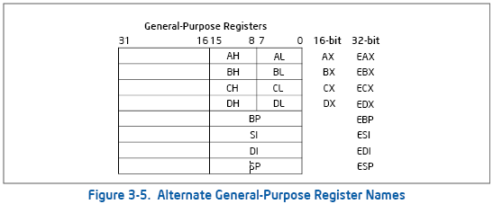
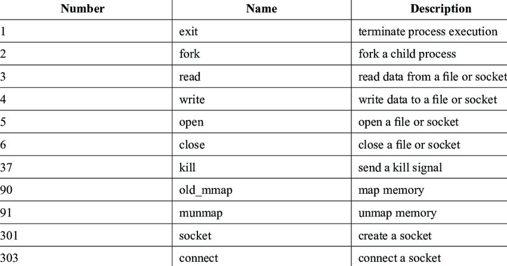

# x86_64_assembly

This repo contains the source code for the x86_64_assembly 32 bit programming language code examples.

# x86_64_assembly registers

`eax` = Accumulator register in our sample codes this register has been used to holds the value of system calls to be executed.

`ebx` = Base register in our sample codes this register has been used to hold the return value of the system call excuted.

`ecx` = Counter register in our sample codes this register has been used  the value of counter register or data defined in .data section.

`edx` = Data register in our sample codes this register has been used to hold the length of data defined in .data section.

`ebp` = Stack pointer register in our sample codes this register holds the value of stack pointer register during function calls.

`esp` = Stack pointer register in our sample codes this register holds the value of stack pointer register.

# Linux system calls numbers

# Repo structure

### Example 1

This directory conatns the simple x86_64_assembly code to invoke exit system call and the program return with exit status 10.

### Example 2

This directory conatns the simple x86_64_assembly code to print simple hello world message.

### Example 3

This directory conatns the simple x86_64_assembly code demonstrates simple branching instruction to jump to skip label.

### Example 4

This directory conatns the simple x86_64_assembly code demonstrates loop instruction.

### Example 5

This directory conatns the simple x86_64_assembly code demonstrates read and write access to .data section.

### Example 6

This directory conatns the simple x86_64_assembly code to demonstrate the use of stack pointer register.

### Example 7

This directory conatns the simple x86_64_assembly code to demonstrate the use of function call.

### Example 8

This directory conatns the simple x86_64_assembly code to demonstrate the use of passing agument to function and getting return value.

### Example 9

This directory conatns the simple x86_64_assembly code to demonstrate the use of gcc compiler to compile x86_64_assembly code.

****
Each directory conatins make file to compile and run the code which is nothing but sophsticated version of compile.sh script to run and compile x86_64_assembly code.
****

## References

1. https://flint.cs.yale.edu/cs421/papers/x86-asm/asm.html